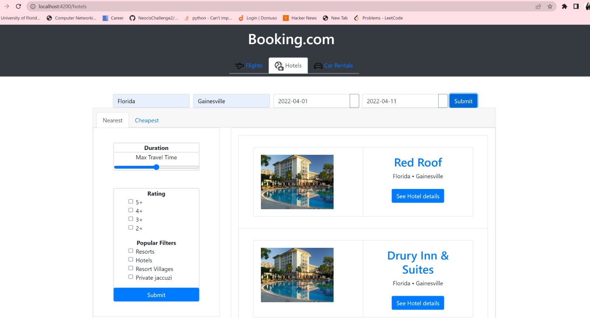

# Booking Website

## Sprint 4

### Group Members:
#### Front End:
- Pranali Suhas Narkar
- Prasann Pradeep Patil
#### Backend:
- Manish Alluri
- Ahamad Shaik

### Sprint 4 overview

In the fourth sprint, we have completed the "Flights" page. We also completed the "hotels" page. We implemented the hotel search, and hotel-listing, hotel-details,hotels-filter,hotel-payment components and wrote cypress test case.

User Stories Dashboard for Sprint 4: -
https://github.com/PrasannPradeepPatil/Booking-Website/projects/1?card_filter_query=label%3A%22sprint+4%22

### Completed Features: -
1. hotels-search component: We have implemented the hotel-search component with input fields like hotel location, start date, and end date. The user will hit the search button which will return a list of hotels at the input location and available within the input date range.

2. hotels-listing component: This component displays the list of the hotels that were returned by the backend based on the 
hotel-search inputs. The lists display the hotel image along with some hotel details returned by the backend.

3. hotel-details component: This component is a modal component that appears when we seect a hotel from the list. Based on the 
chosen hotel an ID will be passed to backend which will return an response with hotel details which are displayed on the front end
 

4. hotel-filter component : We implementated the hotel filter component. This component sends some filter details to the backend which will return the hotel lists satisfying the filter criteria.
 
 
3. hotel-payment stage1 component: This is the first stage of the hotel payment where the user enters the user details like
name mail adress etc
 

4. hotel-payment-stage2 component: This is the second stage of the payment page that we implemented. This will take the user information and based on the information entered in input which will be sent to the backend. The backend will send the an one time password to an email service. The user will be prompted to enter the otp details and once the details matches then the user will be directed to the confirmation page.
 
 
 

5. Payment-stage3 component: This is the confirmation page after payment is done. This page displays the user payment details and price details along with payment confirmation prompt.
 

### How to run the frontend application: -
npm install
-- This will install all the necessary node modules.

ng serve
This will start the webserver.

End to end testing of Flights Feature:-
![Cypress Testing for Flights]$$$$GIVE CYPRESS GIF$$$$

### Backend API's: -

#### User Registration API

Functionality: 
The User registration API allows the user to input details for registration and stores the data in the backend database with encrypted password and other required info where it is further used for validation when the same user tries to login again.

Calling Conditions:
1. When clicking on the Register button as a new user, API is triggered.
2. This API returns the status of the request as success or failure to create the new user and provides the user ID after successful registration and an error code in case of any errors.
	
Development URI: http://localhost:8080/booking/userRegistration 

Input fields:
1. FirstName
    a. datatype: String
    b. Mandatory field status: mandatory field in the input request.
    c. Mandatory field value: mandatory value
2. LastName
    a. datatype: String
    b. Mandatory field status: mandatory field in the input request.
    c. Mandatory field value: mandatory value

3. EmailId
    a. datatype: String
    b. Mandatory field status: mandatory field in the input request.
    c. Mandatory field value: mandatory value.

4. MobileNumber
    a. datatype: String
    b. Mandatory field status: mandatory field in the input request.
    c. Mandatory field value: mandatory value.

5. Password
    a. datatype: String
    b. Mandatory field status: mandatory field in the input request.
    c. Mandatory field value: mandatory value.

Output fields: The output is a json having the following fields.
1.	status
a.	datatype: String
b.	Mandatory field status: Mandatory field in the response
c.	Mandatory field value: mandatory value (success/failure)

2.	userId
a.	datatype: String
b.	Mandatory field status: Mandatory field in the response
c.	Mandatory field value: mandatory value (an uniqueid created to the user)

3.	error
a.	datatype: String
b.	Mandatory field status: Mandatory field in the response
c.	Mandatory field value: null if status is success else returns error code.

Sample Request Format
{
    "FirstName":"Ahamad",
    "LastName":"Shaik",
    "EmailId":"ahamad@gmail.com",
    "MobileNumber":"+13527093318",
    "Password":"Password@4"
}

Sample response Format
{
    "status": "success",
    "userId": "8",
    "error": ""
}

#### Login API

Functionality: 
This API is triggered when an already registered user logs into his account by providing email and password.

Calling Conditions:
This API is called when user click on login button after entering credentials.
A unique session id is created for the user for that time period to access the data securely preventing the unrestricted access.

Development URI:  http://localhost:8080/booking/login
Input fields:
1. EmailId
	a. datatype: String
	b. Mandatory field status: mandatory field in the input request.
	c. Mandatory field value: mandatory value 

2. Password
	a. datatype: String
	b. Mandatory field status: mandatory field in the input request.
	c. Mandatory field value: mandatory value

Output fields: The output is a json having the following fields.
1. loginStatus
	a. datatype: String
	b. Mandatory field status: Mandatory field in the response
	c. Mandatory field value: mandatory value (success/failure)

2. userId
	a. datatype: String
	b. Mandatory field status: Mandatory field in the response
	c. Mandatory field value: mandatory value

3. error
	a. datatype: String
	b. Mandatory field status: Mandatory field in the response
	c. Mandatory field value: null if status is success else returns error code.

4. token
	a. datatype: String
	b. Mandatory field status: Mandatory field in the response
	c. Mandatory field value: null if status is success else returns error code.

Sample Request Format:
{
"EmailID":"ahamad.999s@gmail.com",
"Password":"Password@4"
}

Sample response Format:
{
"loginStatus": "success",
"userId": "7",
"error": "",
"token": "YWhA==1650429992045030300"
}

#### Flight History API

Functionality: 
Returns the previous history of flights booked until the date when clicked on check previous bookings. This API also uses additional authentication to authenticate a valid user by using two headers.

Calling Conditions:
1. When the customer clicks on previous bookings button for flights on the  webpage.
2. The response is a json field with the values given below.

Development URI: http://localhost:8080/booking/PostLoginFlight 

Input fields:
1. UserId
    a. datatype: String
    b. Mandatory field status: mandatory field in the input request.
    c. Mandatory field value: mandatory value

Output fields: The output is a json having the following fields.
1.  Status
    a. datatype: String
    b. Mandatory field status: Mandatory field in the response
    c. Mandatory field value: mandatory value 
2. Response
    a. datatype: String or numeric
    b. Mandatory field status: Mandatory field in the response
    c. Mandatory field value: mandatory value

1. ReferenceNumber
    a. datatype: String
    b. Mandatory field status: Mandatory field in the response
    c. Mandatory field value: mandatory value.
2. Bookingdates
    a. datatype: String
    b. Mandatory field status: Mandatory field in the response
    c. Mandatory field value: mandatory value.
3. Source
    a. datatype: String
    b. Mandatory field status: Mandatory field in the response
    c. Mandatory field value: mandatory value.
4. Destination
    a. datatype: String
    b. Mandatory field status: Mandatory field in the response
    c. Mandatory field value: mandatory value.
5. ID
    a. datatype: String
    b. Mandatory field status: Mandatory field in the response
    c. Mandatory field value: mandatory value.
6. Price
    a. datatype: String
    b. Mandatory field status: Mandatory field in the response
    c. Mandatory field value: mandatory value.

Sample Request Format:
 {
"UserId":""
}
Sample Response Format:
{
"status": "",
"response":[
{
"referenceNumber": "",
"bookingDates": "",
"source": "",
"destination": "",
"id": "",
"price": ""
}]
}

#### Hotel History API

Functionality:
Returns the previous history of hotels booked until the date when clicked on check previous bookings. This API also uses additional authentication to authenticate a valid user by using two headers.

Calling Conditions:
1. When the customer clicks on previous bookings button for hotels on the  webpage.
2. The response is a json field with the values given below.

Development URI: http://localhost:8080/booking/PostLoginHotel 

Input fields:
1. UserId
    a. datatype: String
    b. Mandatory field status: mandatory field in the input request.
    c. Mandatory field value: mandatory value

Output fields: The output is a json having the following fields.
1.  Status
    a. datatype: String
    b. Mandatory field status: Mandatory field in the response
    c. Mandatory field value: mandatory value 
2. Response
    a. datatype: String or numeric
    b. Mandatory field status: Mandatory field in the response
    c. Mandatory field value: mandatory value

1. ReferenceNumber
    a. datatype: String
    b. Mandatory field status: Mandatory field in the response
    c. Mandatory field value: mandatory value.
2. City
    a. datatype: String
    b. Mandatory field status: Mandatory field in the response
    c. Mandatory field value: mandatory value.
3. State
    a. datatype: String
    b. Mandatory field status: Mandatory field in the response
    c. Mandatory field value: mandatory value.
4. HotelName
    a. datatype: String
    b. Mandatory field status: Mandatory field in the response
    c. Mandatory field value: mandatory value.
5. BookingDates
    a. datatype: String
    b. Mandatory field status: Mandatory field in the response
    c. Mandatory field value: mandatory value.
6. Price
    a. datatype: String
    b. Mandatory field status: Mandatory field in the response
    c. Mandatory field value: mandatory value.
7. ID
    a. datatype: String
    b. Mandatory field status: Mandatory field in the response
    c. Mandatory field value: mandatory value.

Sample Request Format:
 {
"UserId":""
}
Sample Response Format:
{
"status": "",
"response":[
{
"referenceNumber": "",
"City": "",
"State": "",
"HotelName": "",
"bookingDates": "",
"price": "",
"id": "",
}]
}

### How to run the backend application: -
go build
-- This will build all the existing go files in the src folder.

go run main.go
-- Sets up and hosts the APIs on a localhost server and also establishes connection to the database.

### Demo video link
Demo -$$$$VIDEO LINK$$$
